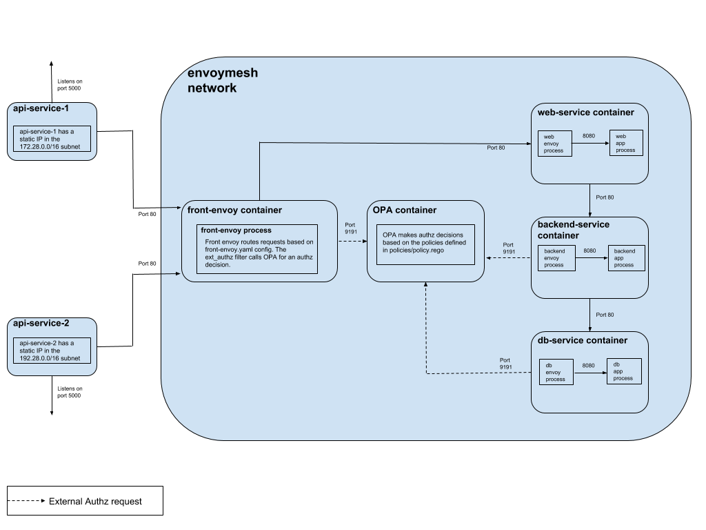

# opa-envoy-ext-authz

OPA-Envoy(v1.10.0) External Authorization Example.

## Overview

Example of using Envoy's [External authorization filter](https://www.envoyproxy.io/docs/envoy/v1.10.0/intro/arch_overview/ext_authz_filter.html) with OPA as an authorization service.

## Example

The example consists of a `front envoy` and a few flask services(`web`, `backend` and `db`) colocated with a running service Envoy. `front-envoy`, `backend` and `db` use the external authorization filter to call OPA for checking if an incoming request is allowed or not.

The `front-envoy` receives all inbound requests from `api-server-1` and `api-server-2` which are deployed in different subnets. The `front-envoy` then forwards requests to the `web` service which calls the `backend` service. The `backend` service calls the `db` service.

- Envoy is listening for ingress on port 80 in each container.
- `api-server-1` and `api-server-2` are flask apps running on port `5000` and `5001` respectively and forward requests to `front envoy`.
- `api-server-1` has a static IP in the `172.28.0.0/16` subnet while `api-server-2` has one in the `192.28.0.0/16` subnet.
- OPA is extended with a GRPC server that implements the [Envoy External authorization API](https://www.envoyproxy.io/docs/envoy/v1.10.0/intro/arch_overview/ext_authz_filter.html). The GRPC server listens by default on port `9191`.
- `data.envoy.authz.allow` is the default OPA policy that decides whether a request is allowed or not.
- Both the GRPC server port and default OPA policy that is queried are configurable. See [config.yaml](./config/config.yaml)



## Running the Example

### Step 1: Install Docker

Ensure that you have recent versions of `docker` and `docker-compose` installed.

### Step 2: Start containers

```bash
$ docker-compose up --build -d
$ docker-compose ps

                Name                               Command               State                            Ports
----------------------------------------------------------------------------------------------------------------------------------------
opa-envoy-ext-authz_api-server-1_1      flask run --host=0.0.0.0         Up      0.0.0.0:5000->5000/tcp
opa-envoy-ext-authz_api-server-2_1      flask run --host=0.0.0.0         Up      0.0.0.0:5001->5000/tcp, 5001/tcp
opa-envoy-ext-authz_backend-service_1   /bin/sh -c /usr/local/bin/ ...   Up      10000/tcp, 80/tcp
opa-envoy-ext-authz_db-service_1        /bin/sh -c /usr/local/bin/ ...   Up      10000/tcp, 80/tcp
opa-envoy-ext-authz_front-envoy_1       /docker-entrypoint.sh /bin ...   Up      10000/tcp, 0.0.0.0:8000->80/tcp, 0.0.0.0:8001->8001/tcp
opa-envoy-ext-authz_opa_1               ./opa_istio_linux_amd64 -- ...   Up      0.0.0.0:9191->9191/tcp
opa-envoy-ext-authz_web-service_1       /bin/sh -c /usr/local/bin/ ...   Up      10000/tcp, 80/tcp
```

### Step 3: Exercise Ingress Policy

The `Ingress Policy` states that the `web` service can **ONLY** be accessed from the subnet `172.28.0.0/16`.

Check that `api-server-1` can access the `web` service.

```bash
$ curl -i localhost:5000/hello

HTTP/1.0 200 OK
Content-Type: text/html; charset=utf-8
Content-Length: 29
Server: Werkzeug/0.15.2 Python/2.7.15
Date: Fri, 19 Apr 2019 09:44:46 GMT

Hello from the WEB service !
```

Check that `api-server-2` **cannot** access the `web` service.

```bash
$ curl -i localhost:5001/hello

HTTP/1.0 403 FORBIDDEN
Content-Type: text/html; charset=utf-8
Content-Length: 40
Server: Werkzeug/0.15.2 Python/2.7.15
Date: Fri, 19 Apr 2019 09:45:19 GMT

Access to the Web service is forbidden.
```

### Step 4: Exercise Service-To-Service Policy

The `Service-To-Service Policy` policy states that a request can flow from the `web` to `backend` to `db` service.

Check that this flow is honored.

```bash
$ curl -i localhost:5000/the/good/path

HTTP/1.0 200 OK
Content-Type: text/html; charset=utf-8
Content-Length: 35
Server: Werkzeug/0.15.2 Python/2.7.15
Date: Fri, 19 Apr 2019 09:48:29 GMT

Allowed path: WEB -> BACKEND -> DB
```

Check that the `web` service is NOT allowed to directly call the `db` service.

```bash
$ curl -i localhost:5000/the/bad/path

HTTP/1.0 403 FORBIDDEN
Content-Type: text/html; charset=utf-8
Content-Length: 26
Server: Werkzeug/0.15.2 Python/2.7.15
Date: Fri, 19 Apr 2019 09:48:46 GMT

Forbidden path: WEB -> DB
```

## Example Policy

The following OPA policy is used in the [Example](#Example) section above.

- `web` service can **ONLY** be accessed from the subnet `172.28.0.0/16`
- a request can flow from the `web` to `backend` to `db` service

```ruby
package envoy.authz

import input.attributes.request.http as http_request
import input.attributes.source.address as source_address

default allow = false

# allow access to Web service from the subnet 172.28.0.0/16
allow {
    net.cidr_contains("172.28.0.0/16", source_address.Address.SocketAddress.address)
}

# allow Web service to access Backend service
allow {
    http_request.path == "/good"
    svc_name == "web"
}

# allow Backend service to access DB service
allow {
    http_request.path == "/good/db"
    svc_name == "backend"
}

svc_name = parsed {
    [_, encoded] := split(http_request.headers.authorization, " ")
    [parsed, _] := split(base64url.decode(encoded), ":")
}
```
